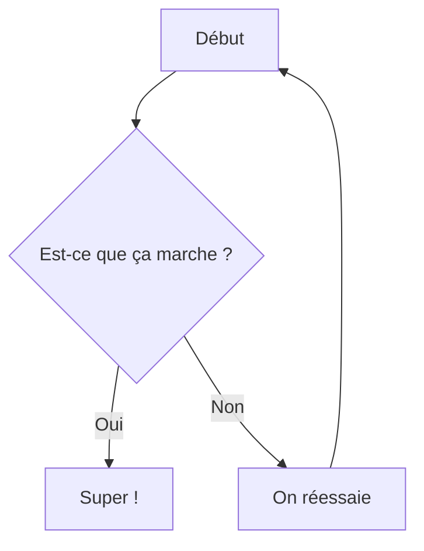

# 🐍 Mini-cours Python (Test de rendu)

Ce court document Markdown est conçu pour tester le **rendu du code Python**, des **formules mathématiques**, des **images** et des **cas particuliers**.

## I / Bases

```python
print("Hello world!")  # Commentaire simple
```

Code en ligne : `a = b + c ** 2`

## II / Variables et mathématiques

Python attribue les types de variables dynamiquement :

```python
x, y = 5, 3
aire = x * y
print(aire)
```

## III / Mathématiques

### Expression

Avec `\displaystyle`:
$$
\displaystyle E = mc^2 \quad \text{et} \quad \int_0^{2\pi} \sin(x) \, dx = 0
$$

Sans `\displaystyle`:
$$
E = mc^2 \quad \text{et} \quad \int_0^{2\pi} \sin(x) \, dx = 0
$$

### Math en ligne
$f(x) = x^2 + 1$

### Bloc de maths
```math
\int_0^{2\pi} \sin(x) \, dx = 0
```

## IV / Images et liens

Image en ligne :


Exemple de lien : [Documentation officielle de Python](https://docs.python.org/3/)

## V / Tableau

| Nom   | Type                       | Exemple   |
| ----- | -------------------------- | --------- |
| int   | Entier                     | `42`      |
| float | Nombre à virgule flottante | `3.14`    |
| str   | Chaîne de caractères       | `"fusée"` |

## VII / Autres langages

```java
public class Main {
  public static void main(String[] args) {
    System.out.println("Hello world!");
  }
}
```

```bash
echo "Hello world!"
```

## VII / Mise en forme

**Gras**, *italique*, ~~barré~~ et `code en ligne`

## VIII / Librairies

```python
import numpy as np
import matplotlib.pyplot as plt

x = np.linspace(0, 10, 1000)
y = np.sin(x)

plt.plot(x,y)
```

## IX / Graphes mermaid



## X / Composants customs

### Outlines

:::outline{outlineType="REMARQUE"}
Il faut apprendre ses cours !
Et être sage.
Et travailler.
Et manger ses légumes.
Et respecter l'autorité.

$$\int_0^{2\pi} \sin(x) \, dx = 0$$
:::

::outline[Sinon pas de cadeaux à noël!]{outlineType="REMARQUE"}

:outline[Imagine tu fais un test.]

### Video

::video{link="https://www.youtube-nocookie.com/embed/3_P-dxrNCq8?si=UDquzF6rLCU4YTBC"}

### Quizz

