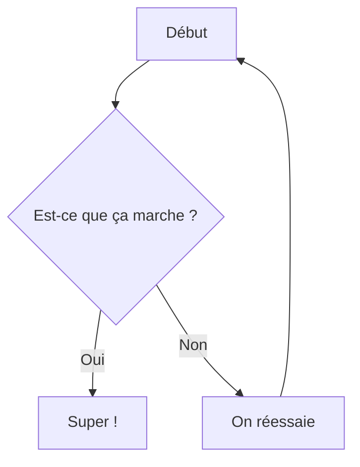

# 🐍 Mini-cours Python (Test de rendu)

Ce document Markdown complet sert de bac à sable pour valider la conformité de rendu du visualiseur de cours.

## I / Syntaxe et Mise en Forme Markdown

### 1. Style de texte
**Gras**, *italique*, ~~barré~~ et `code en ligne`.

### 2. Blocs de citation
> **Règle d'or** : Le code est lu beaucoup plus souvent qu'il n'est écrit. — *Guido van Rossum (Créateur de Python)*

### 3. Listes de tâches
- 🐍 Apprendre la syntaxe de base de Python
- 🧪 Configurer son premier test unitaire
- 🚀 Exécuter les tests avec `pytest` et valider

### 4. Tableaux
| Nom   | Type                       | Exemple   |
| ----- | -------------------------- | --------- |
| int   | Entier                     | `42`      |
| float | Nombre à virgule flottante | `3.14`    |
| str   | Chaîne de caractères       | `"fusée"` |

### 5. Blocs pliables (HTML Details)
<details>
  <summary>💡 Besoin d'un indice pour l'exercice ?</summary>
  Pensez à utiliser `sys.exit(0)` ou `sys.exit(1)` pour renvoyer le code de statut d'erreur adéquat dans votre script !
</details>

## II / Mathématiques et Formules (KaTeX)

### 1. Expressions mathématiques en ligne
La fonction est définie par $f(x) = x^2 + 1$ pour tout réel $x$.

### 2. Blocs d'équations (Standard)
```math
\int_0^{2\pi} \sin(x) \, dx = 0
```

### 3. Équations centrées complexes (avec et sans `\displaystyle`)
Avec `\displaystyle` (recommandé pour de grandes intégrales) :
$$
\displaystyle E = mc^2 \quad \text{et} \quad \int_0^{2\pi} \sin(x) \, dx = 0
$$

Sans `\displaystyle` :
$$
E = mc^2 \quad \text{et} \quad \int_0^{2\pi} \sin(x) \, dx = 0
$$

## III / Multimédia (Images & Liens)

### 1. Liens hypertexte
Pour plus d'informations, consultez la [Documentation officielle de Python](https://docs.python.org/3/).

### 2. Images standard en ligne


### 3. Balises HTML d'image


## IV / Algorithmique & Programmation Interactive (Python)

### 1. Entrées & Sorties standard
Écriture dans la sortie standard (`stdout`) :
```python
print("Hello world!")  # Commentaire simple
```

Écriture dans la sortie d'erreur standard (`stderr`) :
```python
import sys
print("Ceci est une erreur", file=sys.stderr)
```

Lecture réactive depuis l'entrée standard (`stdin`) :
```python
age = input("Quel age avez-vous : ")
print("Vous avez", age, "ans")
```

### 2. Typage et variables
```python
x, y = 5, 3
aire = x * y
print(aire)
```

### 3. Visualisation de données (Matplotlib & NumPy)
```python
import numpy as np
import matplotlib.pyplot as plt

x = np.linspace(0, 10, 1000)
y = np.sin(x)

plt.plot(x, y)
```

## V / Coloration syntaxique d'autres langages

### 1. Exemple Java
```java
public class Main {
  public static void main(String[] args) {
    System.out.println("Hello world!");
  }
}
```

### 2. Exemple Bash Shell
```bash
echo "Hello world!"
```

## VI / Schémas et Diagrammes (Mermaid)



## VII / Composants Personnalisés

### 1. Lecteur vidéo intégré
::video{link="https://www.youtube-nocookie.com/embed/3_P-dxrNCq8?si=UDquzF6rLCU4YTBC"}

### 2. Cartes de remarques et d'avertissements (Outlines)
:::outline{outlineType="REMARQUE"}
Il faut apprendre ses cours !
Et être sage.
Et travailler.
Et manger ses légumes.
Et respecter l'autorité.

$$\int_0^{2\pi} \sin(x) \, dx = 0$$
:::

::outline[Sinon pas de cadeaux à noël!]{outlineType="REMARQUE"}

:outline[Imagine tu fais un test.]

### 3. Quizz interactif intégré
::quiz{id="1"}
