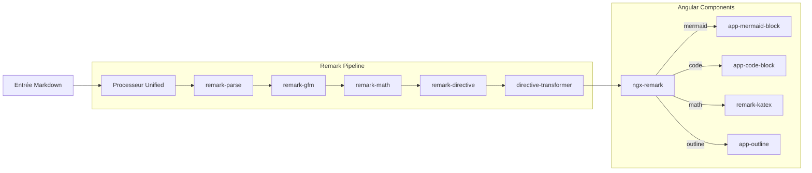

# Markdown Viewer

## Introduction

Le `MarkdownViewer` utilise `ngx-remark` comme moteur de rendu, s'appuyant sur l'écosystème `unified` et `remark`. Il est conçu pour offrir une expérience riche et interactive via l'utilisation de nos composants personnalisés.



## Fonctionnalités

- **GFM (GitHub Flavored Markdown)** : Support complet des tableaux, listes de tâches, liens vers des autolinks, etc.
- **Mathématiques (KaTeX)** : Rendu des équations mathématiques en ligne (`$ ... $`) et en bloc (`$$ ... $$`).
- **Diagrammes (Mermaid)** : Support natif des blocs de code `mermaid` via le composant `MermaidBlock`.
- **Exécution de code (Pyodide)** : Les blocs de code peuvent être exécutés côté client si une instance de Pyodide est fournie.
- **Directives personnalisées** : Utilisation de `remark-directive` pour des extensions de syntaxe (ex: `:::outline`).
- **Stylisation personnalisée** : Un fichier `markdown.scss` dédié gère l'apparence des éléments rendus (titres, listes, tableaux, etc.).

## Utilisation

### Entrées (Inputs)

| Propriété | Type | Par défaut | Description |
| :--- | :--- | :--- | :--- |
| `markdown` | `string` | `''` | Le contenu Markdown à afficher. |
| `pyodide` | `Pyodide` | `undefined` | Instance de l'engin Pyodide pour l'exécution du code. |
| `packages` | `string[]` | `[]` | Liste des packages Python à pré-charger dans Pyodide. |

### Exemple de configuration

```html
<app-markdown-viewer 
  [markdown]="monContenuMarkdown"
  [pyodide]="pyodideService"
  [packages]="['numpy', 'pandas']">
</app-markdown-viewer>
```

