# Pyodide Angular Service

A production-grade Angular service for running Python code in the browser via [Pyodide](https://pyodide.org/), with full support for standard I/O, keyboard interrupt, matplotlib plot output, and an in-memory virtual filesystem.

## Architecture Overview

The service is composed of **three distinct execution contexts** that communicate via message passing:

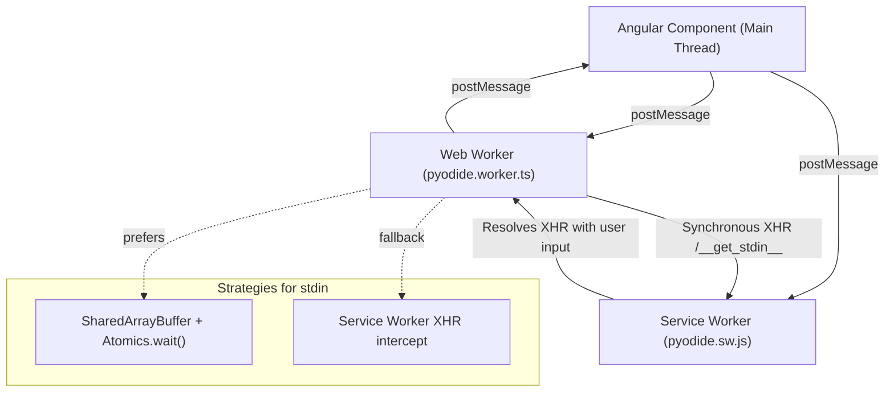

| Context | File | Runs In | Purpose |
|---|---|---|---|
| **Angular Service** | `pyodide.ts` | Main thread | Public API, state management, message routing |
| **Web Worker** | `pyodide.worker.ts` | Worker thread | Loads & runs Pyodide, handles FS ops |
| **Service Worker** | `pyodide.sw.js` | SW thread | Intercepts sync XHR for blocking stdin |

---

## File Structure

```
pyodide/
├── pyodide.ts          # Angular @Injectable service (main thread)
├── pyodide.worker.ts   # Web Worker (Python runtime)
├── pyodide.sw.js       # Service Worker (stdin XHR interceptor)
├── pyodide.types.ts    # Shared types: PyodideRequest, PyodideResponse, ExecutionContext
└── pyodide.spec.ts     # Jasmine unit test stub
```

---

## How It Works

### Initialization

Calling `pyodide.init(packages?)` sets up two workers in parallel:

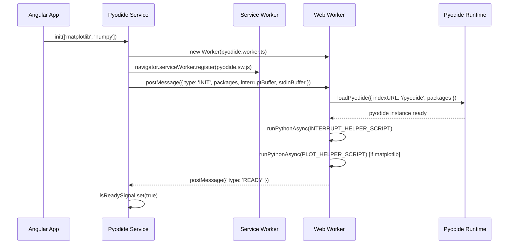

Two `SharedArrayBuffer` instances are allocated during init if the browser supports them:

| Buffer | Size | Purpose |
|---|---|---|
| `interruptBuffer` | 1 byte (`Uint8Array`) | Passed to `pyodide.setInterruptBuffer()`. Value `2` triggers `KeyboardInterrupt`. |
| `stdinBuffer` | 64 KB (`Int32Array`) | Used for `Atomics`-based stdin. Index 0 is the state flag; bytes from offset 4 onwards hold the text data. |

**`isReady`** is a read-only Angular `Signal<boolean>` that components can use to gate UI interactions.

---

### Running Code

`pyodide.run(code)` dispatches code to the worker and returns an `ExecutionContext` immediately.

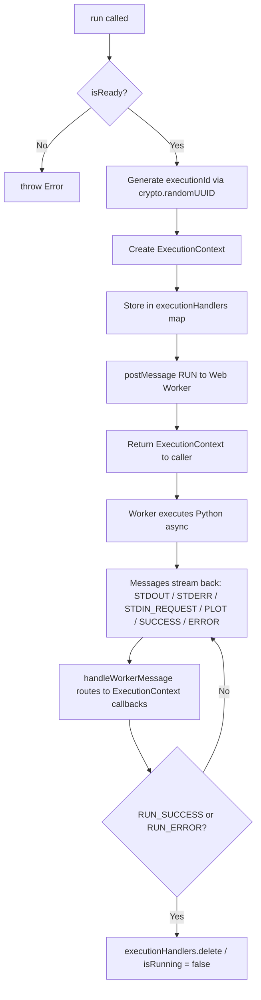

Each execution is **isolated by a UUID**, allowing multiple concurrent executions (though Pyodide itself is single-threaded inside the worker).

---

### Standard Input (stdin)

Stdin is the most complex part of the service because Python's `input()` call is **synchronous** — it blocks until a string is returned — but user input arrives **asynchronously**. Two strategies are used, in priority order.

#### Strategy 1: SharedArrayBuffer + Atomics

When `SharedArrayBuffer` is available (requires `Cross-Origin-Opener-Policy` and `Cross-Origin-Embedder-Policy` headers):

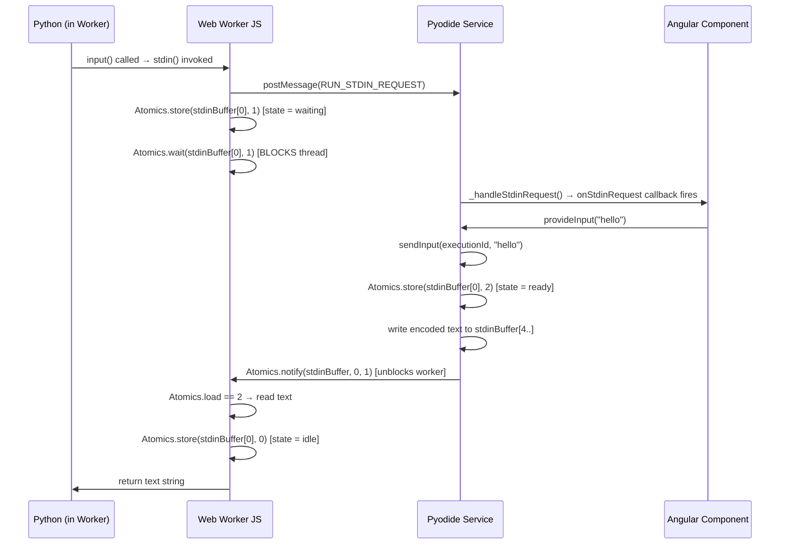

**State machine for `stdinBuffer[0]`:**

```
0 = idle
1 = waiting for input  (worker is blocked on Atomics.wait)
2 = input ready        (main thread has written data, unblocking worker)
```

The text payload is encoded as UTF-8 bytes starting at byte offset `4` (after the 4-byte `Int32` flag), terminated with a null byte (`0x00`).

#### Strategy 2: Service Worker XHR Intercept

When `SharedArrayBuffer` is unavailable (the more common case in non-isolated origins), a fallback using a Service Worker is used. The Worker issues a **synchronous XMLHttpRequest** to `/__get_stdin__?id={executionId}`, which the Service Worker intercepts and holds open until user input arrives.

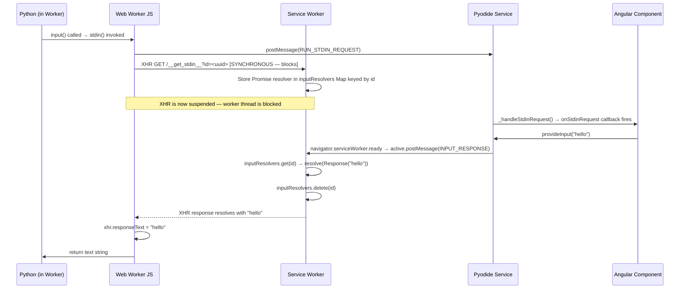

The Service Worker is the critical bridge here: it "hangs" the HTTP fetch event until it receives a matching `INPUT_RESPONSE` message from the main thread. This turns an async event into a synchronous one from the worker's perspective.

**Important:** The service worker is registered with `scope: '/'` so it can intercept the `/__get_stdin__` URL regardless of the app's base path.

---

### Standard Output & Standard Error

The worker registers character-by-character raw handlers using `pyodide.setStdout` and `pyodide.setStderr`. Each character is appended to a local buffer, and the buffer is flushed and sent as a `RUN_STDOUT` / `RUN_STDERR` message whenever a newline (`\n`) is encountered. Any remaining content in the buffers is flushed in the `finally` block after execution completes.

This line-by-line streaming means output appears in the UI progressively, not all at once.

---

### Interrupts (Ctrl+C)

`interruptExecution(executionId)` uses a three-layer approach to handle all code patterns:

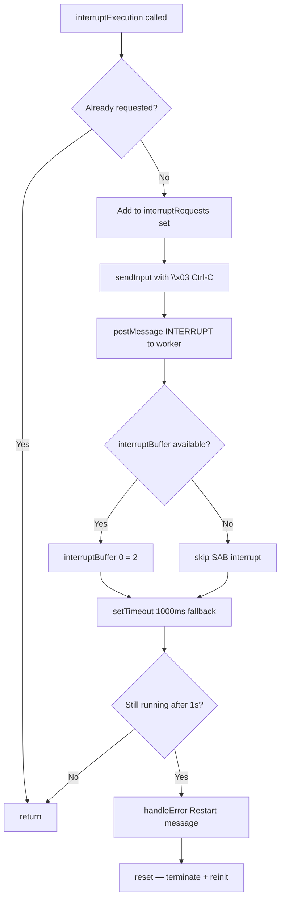

**Why three methods?**

| Method | Handles |
|---|---|
| `sendInput('\x03')` | Python blocked in `input()` — immediately resolves the pending XHR/Atomics with Ctrl-C, which the worker detects and calls `_raise_interrupt()` |
| `postMessage({ type: 'INTERRUPT' })` | Python in a yielding loop — calls `_raise_interrupt()` directly in the worker's JS context between async yields |
| `interruptBuffer[0] = 2` | Python in a tight CPU-bound loop — `pyodide.setInterruptBuffer` causes Pyodide to inject a `KeyboardInterrupt` at the C level |
| 1-second timeout + `reset()` | Last resort for truly stuck code — terminates and recreates the worker |

The `\x03` character is detected in both the Atomics path and the XHR path:

```typescript
if (text.includes('\x03')) {
  raiseInterrupt(); // calls Python's _raise_interrupt()
  return '';
}
```

---

### Plot Output (matplotlib)

When `matplotlib` is included in the initial packages, the worker runs a setup script that:

1. Sets the backend to `Agg` (non-interactive, renders to buffer)
2. Patches `plt.show` to a no-op (prevents blocking calls)
3. Defines `_fetch_last_plot()` — a Python helper that captures the last figure as a base64-encoded PNG and closes it

After each successful code run, the worker calls `_fetch_last_plot()`. If a base64 string is returned, it sends a `RUN_PLOT_OUTPUT` message. This pattern means plot output arrives after all stdout/stderr has been streamed.

---

### Virtual Filesystem

Pyodide exposes an Emscripten-based virtual filesystem (`pyodide.FS`) that is accessible from the worker. The service wraps it with promise-based methods for bidirectional communication.

Operations without a return value (write, delete, mkdir, rmdir) are fire-and-forget:

```typescript
writeFile(path, content) → postMessage(WRITE_FILE) → pyodide.FS.writeFile(...)
```

Operations with a return value (readFile, listDir) use a one-time inline listener pattern:

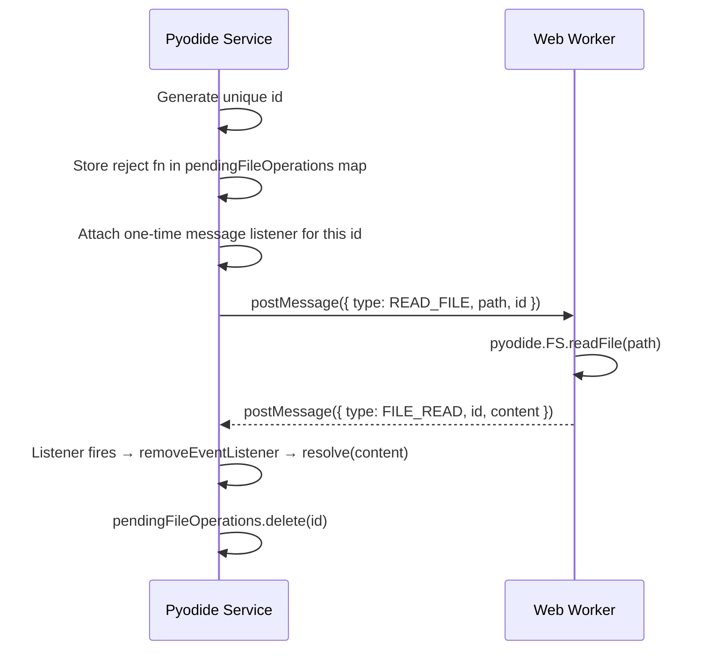

If the environment is reset while a file operation is pending, all stored reject functions are called to prevent memory leaks and unresolved promises.

---

## API Reference

### Pyodide Service

```typescript
@Injectable()
export class Pyodide
```

Provided as a non-root injectable — you must add it to your component or module `providers`.

| Method | Signature | Description |
|---|---|---|
| `init` | `(packages?: string[]) => void` | Starts the Web Worker and Service Worker. Idempotent — safe to call multiple times. |
| `reset` | `() => void` | Terminates the worker, clears all state, re-initializes. Rejects all pending file operations. |
| `run` | `(code: string) => ExecutionContext` | Dispatches Python code to the worker. Returns an `ExecutionContext` for wiring up callbacks. Throws if not ready. |
| `loadPackages` | `(packages: string[]) => void` | Dynamically load additional micropip/pyodide packages. |
| `writeFile` | `(path: string, content: string) => void` | Writes a UTF-8 string to the Pyodide virtual filesystem. |
| `readFile` | `(path: string) => Promise<string>` | Reads a file from the virtual filesystem. |
| `deleteFile` | `(path: string) => void` | Deletes a file. |
| `mkdir` | `(path: string) => void` | Creates a directory. |
| `rmdir` | `(path: string) => void` | Removes a directory. |
| `listDir` | `(path: string) => Promise<string[]>` | Lists directory contents (`.` and `..` are filtered out). |
| `isReady` | `Signal<boolean>` (readonly) | Angular signal that is `true` when Pyodide is initialized and ready to run code. |
| `error` | `Signal<string \| null>` (readonly) | Angular signal that emits global worker errors. |

---

### ExecutionContext

Returned by `run()`. Provides a fluent, callback-based API for streaming execution results.

```typescript
class ExecutionContext
```

**Builder methods** (chainable):

| Method | Signature | Description |
|---|---|---|
| `onOutput` | `(callback: (text: string) => void) => this` | Called for each line of stdout. |
| `onError` | `(callback: (text: string) => void) => this` | Called for each line of stderr, and on unhandled exceptions. |
| `onPlot` | `(callback: (base64: string) => void) => this` | Called with a base64 PNG string when matplotlib generates a plot. |
| `onStdinRequest` | `(callback: () => void) => this` | Called when Python's `input()` is waiting. Use this to show an input prompt in your UI. |

**Action methods:**

| Method | Signature | Description |
|---|---|---|
| `provideInput` | `(text: string) => void` | Sends input to satisfy a pending `input()` call. |
| `interrupt` | `() => void` | Sends a `KeyboardInterrupt` to the running code. |

**State:**

| Property | Type | Description |
|---|---|---|
| `isRunning` | `Signal<boolean>` (readonly) | `true` while code is executing. Set to `false` on success or error. |
| `executionId` | `string` (readonly) | The UUID identifying this execution. |

---

### Types

#### `PyodideRequest`

Messages sent **from the main thread to the Web Worker**:

| Type | Payload | Description |
|---|---|---|
| `INIT` | `packages?, interruptBuffer?, stdinBuffer?` | Initialize Pyodide with optional packages and shared buffers |
| `RUN` | `id, code` | Run Python code string |
| `LOAD_PKG` | `packages` | Dynamically load additional micropip/pyodide packages |
| `INTERRUPT` | — | Signal the worker to raise `KeyboardInterrupt` |
| `WRITE_FILE` | `path, content` | Write a string to the virtual FS |
| `READ_FILE` | `path, id` | Read a file; response keyed by `id` |
| `DELETE_FILE` | `path` | Delete a file from virtual FS |
| `MKDIR` | `path` | Create a directory |
| `RMDIR` | `path` | Remove a directory |
| `LIST_DIR` | `path, id` | List directory; response keyed by `id` |

#### `PyodideResponse`

Messages sent **from the Web Worker to the main thread**:

| Type | Payload | Description |
|---|---|---|
| `READY` | — | Pyodide is initialized and ready |
| `LOADING` | — | A package is being loaded |
| `ERROR` | `error` | An unhandled global error occurred in the worker |
| `RUN_STDIN_REQUEST` | `id` | Python called `input()` and is now blocked |
| `RUN_STDOUT` | `id, text` | A line of stdout output |
| `RUN_STDERR` | `id, text` | A line of stderr output |
| `RUN_PLOT_OUTPUT` | `id, base64` | A matplotlib figure as a base64 PNG |
| `RUN_SUCCESS` | `id` | Execution completed without error |
| `RUN_ERROR` | `id, error` | Execution threw an unhandled exception |
| `FILE_READ` | `id, content` | File contents in response to `READ_FILE` |
| `FILE_ERROR` | `id, error` | File operation failed |
| `DIR_LISTED` | `id, contents` | Directory listing in response to `LIST_DIR` |

---

## Message Protocol

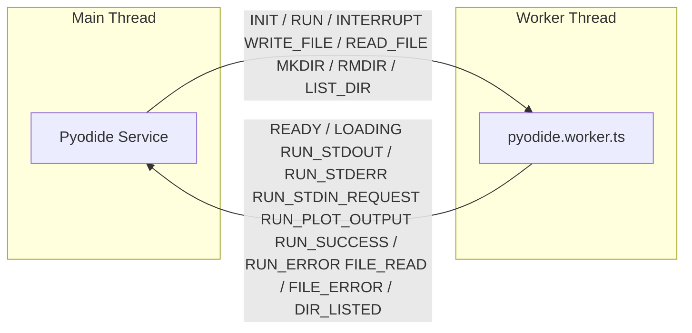

All messages are typed discriminated unions (`PyodideRequest` and `PyodideResponse`), giving full TypeScript type safety across the worker boundary.

---

## Sequence Diagrams

### Initialization Sequence

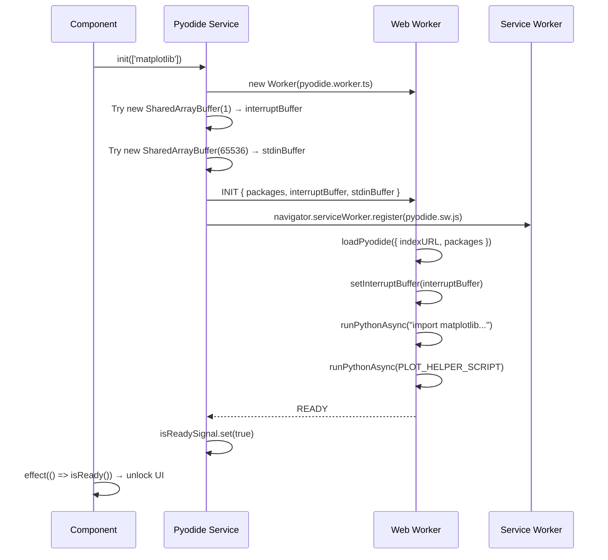

### Code Execution Sequence

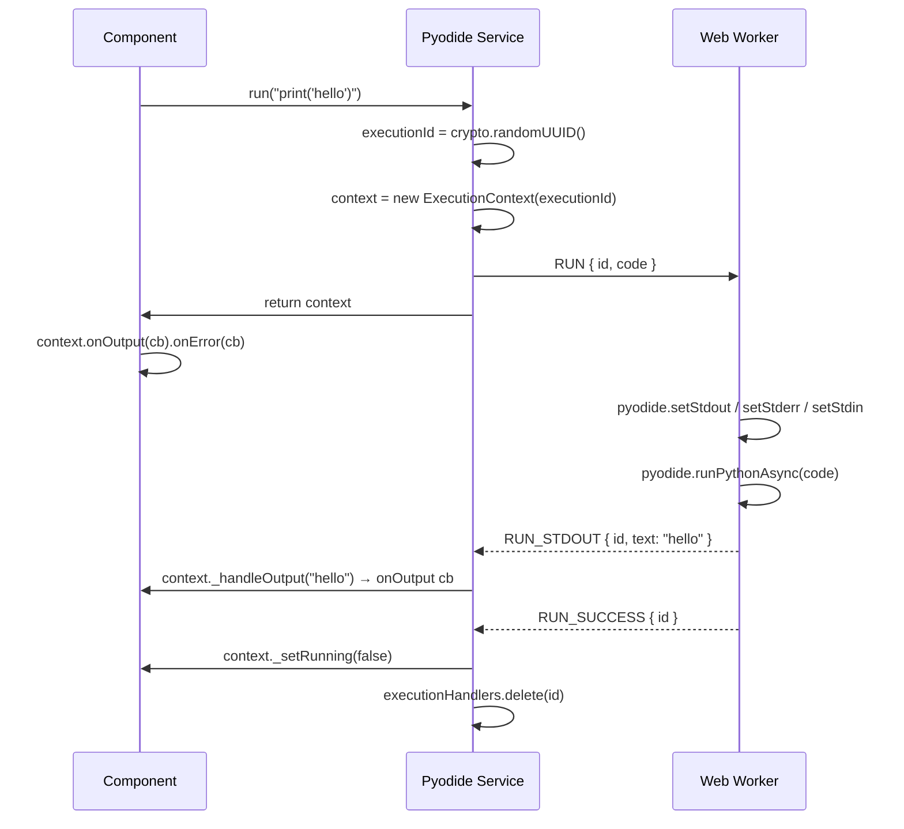

### stdin via SharedArrayBuffer

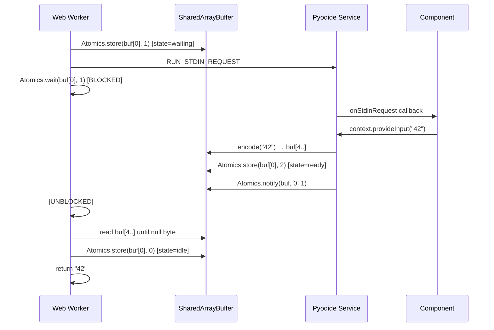

### stdin via Service Worker

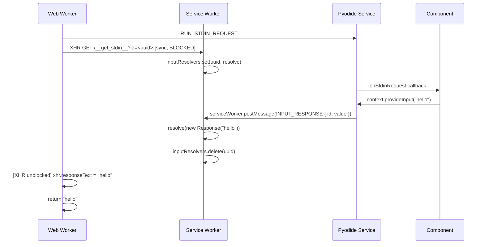

### Interrupt Sequence

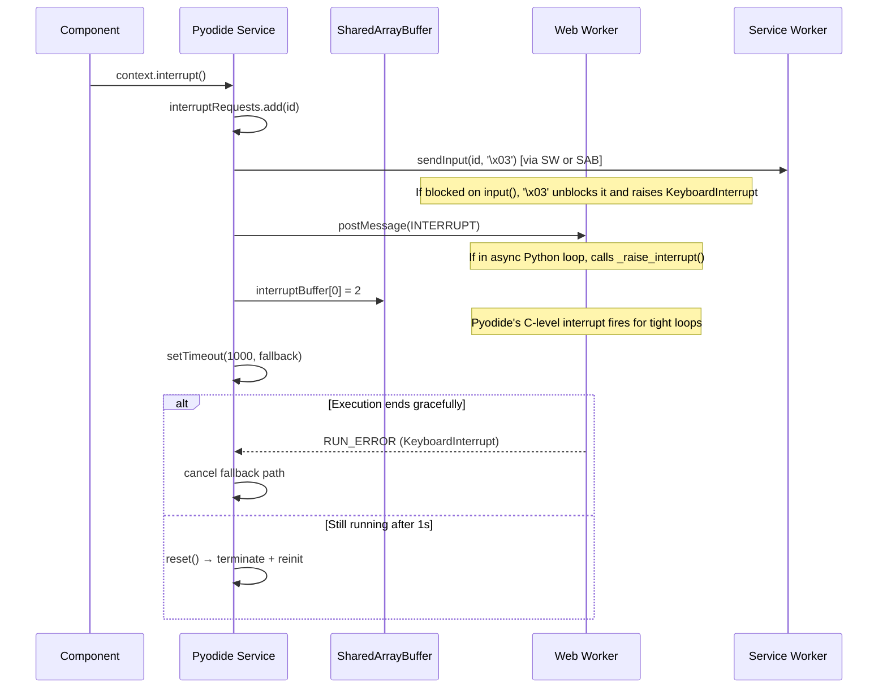

---

## Usage Example

```typescript
import { Component, inject, signal } from '@angular/core';
import { Pyodide } from './pyodide/pyodide';
import { ExecutionContext } from './pyodide/pyodide.types';

@Component({
  selector: 'app-repl',
  providers: [Pyodide], // Provide per-component
  template: `
    <textarea [(ngModel)]="code"></textarea>
    <button (click)="run()" [disabled]="!pyodide.isReady()">Run</button>
    <button (click)="interrupt()" [disabled]="!ctx()?.isRunning()">Stop</button>

    @if (awaitingInput()) {
      <input #inp (keydown.enter)="sendInput(inp.value); inp.value=''" />
    }

    <pre>{{ output() }}</pre>
    @if (plotBase64()) {
      
    }
  `
})
export class ReplComponent {
  protected pyodide = inject(Pyodide);

  protected code = signal('');
  protected output = signal('');
  protected plotBase64 = signal('');
  protected awaitingInput = signal(false);
  protected ctx = signal<ExecutionContext | null>(null);

  ngOnInit() {
    this.pyodide.init(['matplotlib', 'numpy']);
  }

  run() {
    this.output.set('');
    this.plotBase64.set('');

    const context = this.pyodide.run(this.code())
      .onOutput(text => this.output.update(o => o + text))
      .onError(text => this.output.update(o => o + text))
      .onPlot(base64 => this.plotBase64.set(base64))
      .onStdinRequest(() => this.awaitingInput.set(true));

    this.ctx.set(context);
  }

  sendInput(value: string) {
    this.awaitingInput.set(false);
    this.ctx()?.provideInput(value);
  }

  interrupt() {
    this.ctx()?.interrupt();
  }
}
```

---

## Browser Compatibility Notes

### Cross-Origin Isolation (for SharedArrayBuffer)

`SharedArrayBuffer` requires cross-origin isolation. Your server must send these headers:

```
Cross-Origin-Opener-Policy: same-origin
Cross-Origin-Embedder-Policy: require-corp
```

Without these headers, the service gracefully falls back to the Service Worker XHR strategy. Interrupting CPU-bound code (`interruptBuffer`) will not work in this fallback mode, but all other features — including stdin, stdout, stderr, and plot output — will function normally.

### Service Worker Scope

The service worker is registered at scope `/`. This means it intercepts all fetch events for your origin. The `/__get_stdin__` path is reserved for stdin transport and should not be used by your application for other purposes.

### Pyodide Assets

Pyodide's WebAssembly and package files must be served from `/pyodide/` (matching the `indexURL: '/pyodide'` in the worker). Ensure your build pipeline copies the Pyodide distribution to this path.

### Package Loading

Packages listed in `init(packages)` are loaded during initialization. To load packages dynamically at runtime, post a `LOAD_PKG` message directly or add a `loadPackages()` method to the service. The `isReady` signal will emit `false` (`LOADING`) and then `true` (`READY`) around the load.
