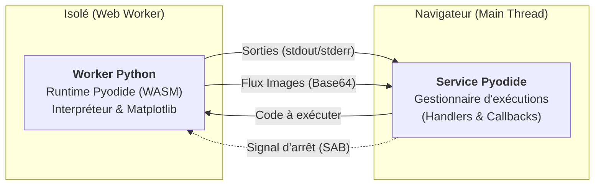
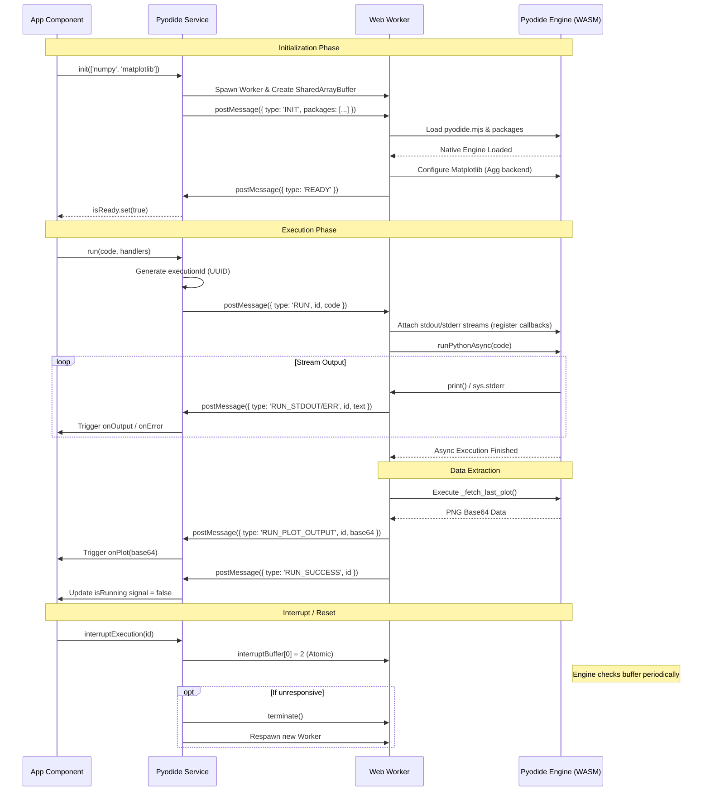

# Architecture du Service Pyodide

Ce document décrit l'architecture et le flux de travail du service Pyodide dans CodeClique.

## Aperçu de l'Architecture



Pyodide est en fait composé de deux éléments principaux:
- le service `pyodide.ts` dont une instance peut être créé dans un composant et passée aux enfants 
- le worker `pyodide.ts` lié à une instance du service et pouvant être redémarré 

### 1. Service Pyodide (`pyodide.ts`) dans le Thread Principal
- **Mappage d'Exécution** : Utilise une `Map<string, ExecutionHandler>` pour suivre les requêtes multiples, qu'elles soient simultanées ou successives. La clé correspond à une éxécution (un bloc de code) et un handler composé de:
```typescript
interface ExecutionHandler {
  onOutput?: (text: string) => void;
  onError?: (text: string) => void;
  isRunning?: WritableSignal<boolean>;
  onPlot?: (base64: string) => void;
}
``` 
- **SharedArrayBuffer** : Utilisé pour les interruptions à rapide. Si le navigateur ne le prend pas en charge (par exemple, en l'absence d'en-têtes d'isolation multi-origine), les interruptions sont désactivées et le Worker est relancé à la place (destructif).
- **Gestion du Worker** : Gère la terminaison et la réinitialisation si le noyau Python plante ou s'il est réinitialisé manuellement.

### 2. Pyodide Worker (`pyodide.worker.ts`) dans un Thread dédié
- **Isolation de l'Environnement** : Garantit que le chargement de Pyodide et les calculs Python intensifs ne figent pas l'interface utilisateur.
- **Assistant Matplotlib** : Injecte un script Python personnalisé (`_fetch_last_plot`) pour capturer les graphiques de `matplotlib.pyplot` et les renvoyer sous forme d'images au frontend.
- **Redirection de Flux** : Redirige les sorties `stdout` et `stderr` de Python vers le système `postMessage` du worker.


## Schéma de fonctionnement

