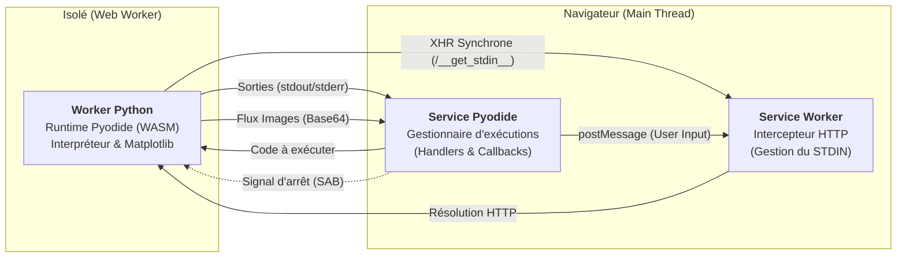
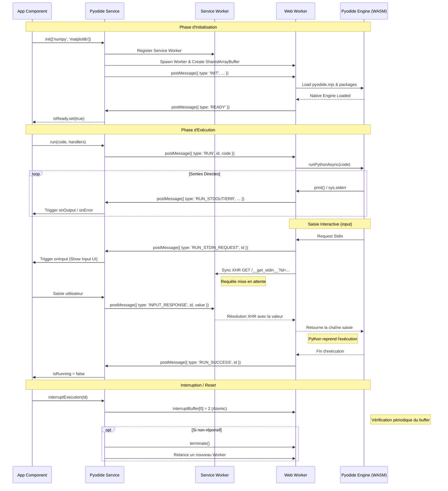

# Architecture du Service Pyodide

Ce document décrit l'architecture et le flux de travail du service Pyodide dans CodeClique.

## Aperçu de l'Architecture



Pyodide est composé de trois éléments principaux:
- le service `pyodide.ts` : Point d'entrée Angular pour gérer le cycle de vie et les exécutions.
- le worker `pyodide.worker.ts` : Thread dédié exécutant l'interpréteur Python (WASM).
- le service worker `pyodide.sw.js` : Gère l'interception des requêtes de saisie utilisateur (STDIN).

### 1. Service Pyodide (`pyodide.ts`) dans le Thread Principal
- **Mappage d'Exécution** : Utilise une `Map<string, ExecutionHandler>` pour suivre les requêtes multiples. Chaque exécution possède son propre ID unique (UUID).
```typescript
interface ExecutionHandler {
  onOutput?: (text: string) => void;
  onError?: (text: string) => void;
  onInput?: (text: string) => void;
  onPlot?: (base64: string) => void;
  isRunning?: WritableSignal<boolean>;
}
``` 
- **SharedArrayBuffer** : Utilisé pour les interruptions atomiques. Si `SharedArrayBuffer` n'est pas disponible, le Worker est terminé puis recréé (méthode destructive).
- **Service Worker Registration** : Enregistre `pyodide.sw.js` au démarrage pour permettre le support des entrées clavier (`input()`).

### 2. Pyodide Worker (`pyodide.worker.ts`) dans un Thread dédié
- **Isolation de l'Environnement** : Garantit que les calculs lourds ne bloquent pas l'UI.
- **Assistant Matplotlib** : Capture les graphiques via un script injecté et les renvoie en Base64.
- **Redirection de Flux** : Redirige `stdout` et `stderr` via `postMessage`.
- **Gestion STDIN** : Implémente `setStdin` en utilisant un `XMLHttpRequest` synchrone vers le Service Worker.

### 3. Service Worker Pyodide (`pyodide.sw.js`)
- **Interception Synchrone** : L'appel `input()` en Python est bloquant. Pour reproduire ce comportement dans le navigateur sans bloquer le thread principal, le Worker effectue une requête HTTP synchrone.
- **Suspension de Requête** : Le SW intercepte `/__get_stdin__` et garde la requête en attente dans une promesse.
- **Déblocage** : Lorsque l'UI reçoit la saisie de l'utilisateur, elle appelle `sendInput()` sur le service, qui notifie le SW via `postMessage`. Le SW résout alors la requête HTTP avec la valeur, débloquant l'exécution Python.
- **Gestion des Flux** : Avant de suspendre l'exécution pour une saisie, le Worker vide ses buffers `stdout` et `stderr` pour s'assurer que les messages de prompt (ex: `input("Entrez votre nom: ")`) sont bien affichés à l'utilisateur.

## Schéma de fonctionnement

